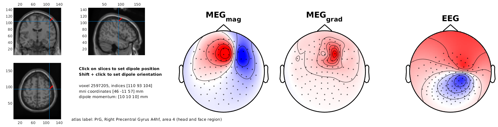

# ft_dipole_topo_MEEG

Dipole scalp topography simulator for [FieldTrip toolbox](https://github.com/fieldtrip/fieldtrip) users.

### Screenshot

See also the recent implementation for MNE-python toolbox users in [this repo](https://github.com/mne-tools/dipole-simulator).

[Bug reports](https://github.com/dnacombo/ft_dipole_sim_MEEG/issues) are welcome.
